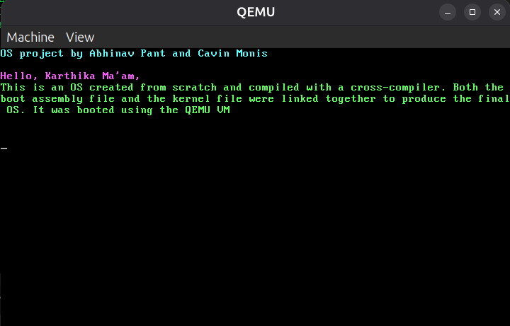

# OS Project - Real Process Scheduling



## Overview

This is a simple operating system built from scratch that demonstrates **preemptive multitasking** with a **round-robin process scheduler**. The OS is compiled using a cross-compiler and boots using QEMU.

## Features

- **VGA Text Mode Display** - 80x25 terminal with color support and scrolling
- **Process Scheduling** - Preemptive round-robin scheduler with time slicing
- **Context Switching** - Simulated process context switches with visual indicators
- **Multiple Processes** - Demonstrates scheduling of 4 processes (ProcessA, ProcessB, ProcessC, IdleProc)
- **Timer Interrupts** - Programmable Interval Timer (PIT) for scheduling decisions

## Prerequisites

Before running this project, make sure you have the following installed on your Linux system:

- **Docker** - Used to build the cross-compilation environment using [gcc-cross-i686-elf](https://hub.docker.com/r/techiekeith/gcc-cross-i686-elf) docker image
- **QEMU** - Required to run the OS kernel (`qemu-system-i386`)
- **GRUB tools** - For multiboot verification

## How to Run

To run the project run the following commands in a Linux OS:

```bash
make
make run
```

## What it does

1. `make` - Builds a Docker container with the i686 cross-compilation toolchain and compiles the kernel
2. `make run` - Runs the compiled kernel using QEMU emulator

The OS will display:
- A greeting message
- Process scheduling demonstration with colored output:
  - **Green A's** - ProcessA executing
  - **Blue B's** - ProcessB executing  
  - **Red C's** - ProcessC executing
  - **Gray dots** - Idle process executing
  - **Pipes (|)** - Context switch indicators
- Scheduling statistics (total context switches)

## Build Process

The build process involves:

1. Creating a Docker environment with i686-elf cross-compiler
2. Assembling the boot loader (`boot.s`)
3. Compiling the kernel (`kernel.c`)
4. Compiling the scheduler (`scheduler.c`)
5. Linking everything together with the custom linker script
6. Verifying multiboot compliance

## Project Structure

```
.
├── boot.s           # Assembly bootloader (multiboot compliant)
├── kernel.c         # Main kernel with VGA terminal functions
├── scheduler.c      # Process scheduler implementation
├── scheduler.h      # Scheduler header and data structures
├── linker.ld        # Linker script for memory layout
├── makefile         # Build automation
└── buildenv/        # Docker build environment
    └── Dockerfile
```

## OS Concepts Demonstrated

- **Process Control Block (PCB)** - Stores process state, stack pointers, and metadata
- **Round-Robin Scheduling** - Fair CPU time distribution with time slicing
- **Preemptive Multitasking** - Processes can be interrupted by timer
- **Context Switching** - Switching between processes
- **Process States** - READY, RUNNING, BLOCKED, TERMINATED

## Authors

By **Abhinav Pant** and **Cavin Monis**
